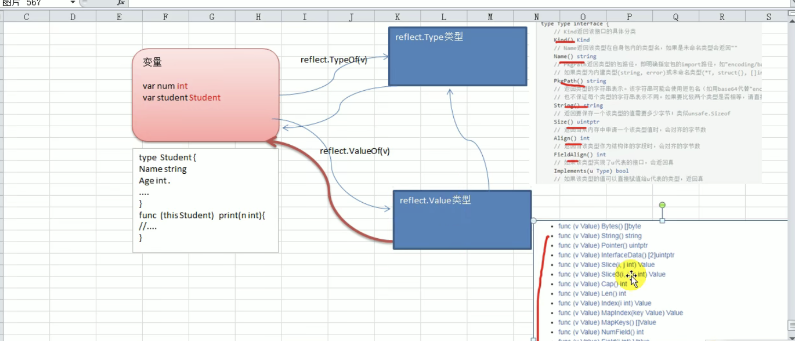
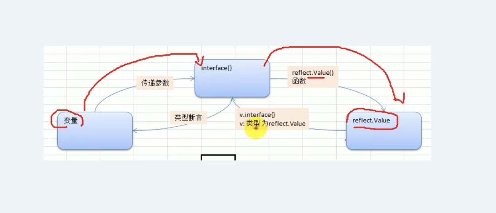
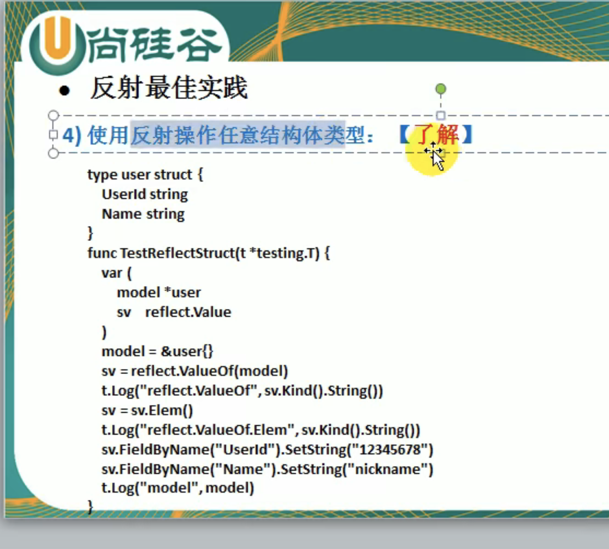
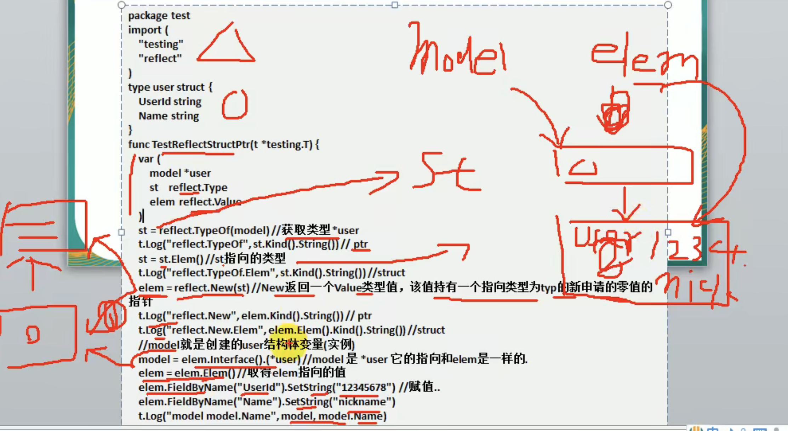
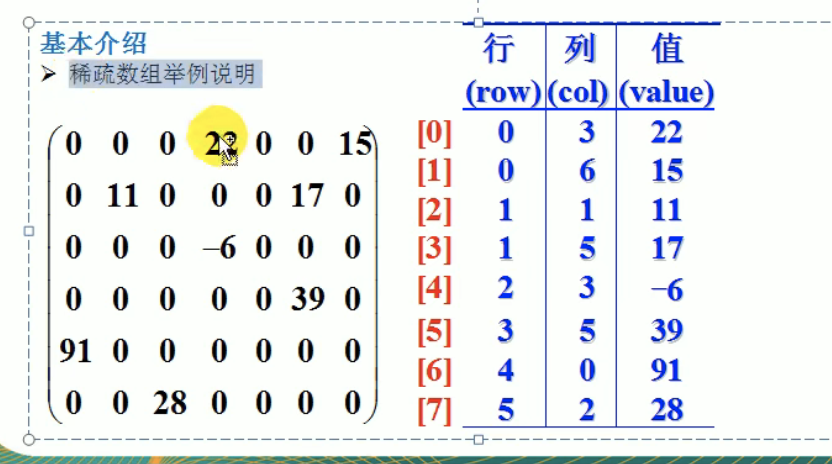
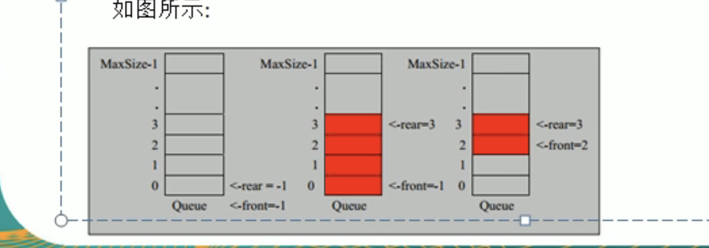
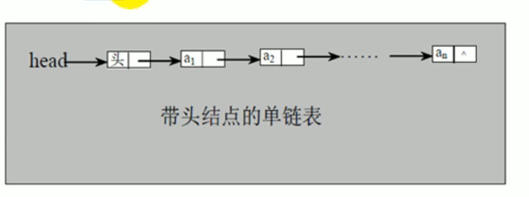
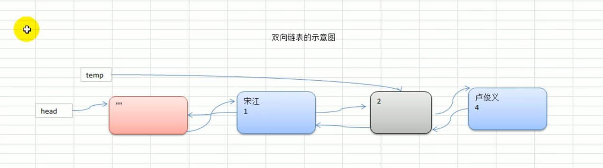
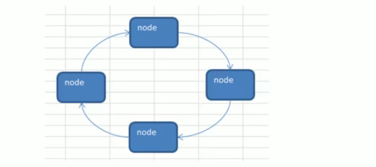

## 14.文件操作
#### 14.1 文件的基本介绍

文件就是数据源，在程序中是以流的形式来操作的。golang程序<--->文件（中间就是流）

**流:**数据在数据源和程序之间经历的路径

- 输入流：数据从数据源（文件）到程序（内存）的路径【读文件】
- 输出流：数据在程序（内存）到数据源（文件）的路径【写文件】

os.File封装了所有文件的相关操作，File是一个结构体。这里经常会用到os.File

#### 14.2 文件的基本操作

1) 打开一个文件进行读操作：os.Open(name string)(*File,error)
2) 关闭一个文件：File.Close()

```go
package main

import (
	"fmt"
	"os"
)

func main()  {
	//打开一个文件
	file,err := os.Open("/home/jeremyke/Desktop/a1.txt")
	if err != nil {
		fmt.Println("打开失败：",err)
	}
	//输出文件
	fmt.Println(&file)//xo11121 说明：文件是一个指针
	//关闭文件
	file.Close()
}

```

#### 14.3 读取文件的应用实例

1) 读取文件的内容，并显示在终端（带缓冲区的方式）

```go
func main()  {
	//打开一个文件
	file,err := os.Open("/home/jeremyke/Desktop/a.txt")
	if err != nil {
		fmt.Println("打开失败：",err)
	}
	//关闭文件
	defer file.Close()

	//创建*Reader,是带缓冲的 默认大小4K
  //NewReader返回 
	reader := bufio.NewReader(file)
	for {
    //ReadString是bufio包的一个函数，它读取直到第一次遇到delim字节，返回一个包含已读取的数据和delim字节的字符串。如果ReadString方法在读取到delim之前遇到了错误，它会返回在遇到错误之前读取的数据以及该错误（一般是io.EOF）。当且仅当ReadString方法返回的切片不以delim结尾时，会返回一个非nil的错误。
		str,err := reader.ReadString('\n')//读到一个换行就结束
		if err == io.EOF || err !=nil {//io.EOF文件的末尾
			break
		}
		fmt.Print(str)
	}
	fmt.Println("文件读取结束")

}
```

2) 读取文件的内容并且显示在终端（使用ioutil一次将整个文件读入内存中），这种方式适用于文件不大的情况。ioutil.ReadFile

```go
func main()  {
	fileName := "/home/jeremyke/Desktop/a.txt"
	content,err := ioutil.ReadFile(fileName)
	if err != nil {
		fmt.Println("读取失败：",err)
	}
	fmt.Printf("%v",string(content))//这个方法不需要显示的打开和关闭文件
}
```

#### 14.4 写文件的应用实例

func OpenFile(name string,flag int,perm FileMode)(file *File,err error)

**说明：** os.OpenFile是一个更一般性的文件打开函数，他会使用指定的选项（如：O_RDONLY等），指定的模式（如0666等）打开指定名称的文件。操作成功，返回文件对象可用于I/O，如果出错，错误底层类型是*PathError
        

```go
func main()  {
	fileName := "/home/jeremyke/Desktop/b.txt"
	file,err := os.OpenFile(fileName,os.O_WRONLY | os.O_CREATE,0666)
	if err !=nil {
		fmt.Println("打开文件失败：",err)
	}
	defer file.Close()

	//写入缓冲流
	str := "hello klp\n"
	writer := bufio.NewWriter(file)
	for i := 5; i>0; i-- {
		writer.WriteString(str)
	}
	//刷入文件
	writer.Flush()
}
```
- 从一个文件读取内容写入到另外一个文件

```go
func main()  {
	readFileName := "/home/jeremyke/Desktop/b.txt"
	writeFileName := "/home/jeremyke/Desktop/a.txt"
	data,err := ioutil.ReadFile(readFileName)
	if err !=nil {
		fmt.Println("打开文件失败：",err)
	}
	if err2 := ioutil.WriteFile(writeFileName,data,0777);err2 != nil {
		fmt.Println("写入文件失败：",err2)
	}
}
```
- 判断文件是否存在
Golang中判断文件或者文件目录是否存在的方法是os.Stat()函数返回的错误值进行判断：
1) 返回nil,说明文件或者文件目录存在
2) 返回的错误类型为os.IsNotExist()判断为true，说明文件或者文件目录不存在
3) 返回的错误类型为其他类型，则不确定是否存在

```go
func PathExists(path string)(bool,error){
    _,err := os.Stat(path)
    if err ==nil {
        return true,nil
    }
    if os.IsNotExist(err) {
        return false,nil
    }
    return false,err
}
```

#### 14.5 命令行参数

os.Args是一个string切片，用来存储所有的命令行参数。第一个是程序名称，后面的都是参数。

###### 14.5.1 应用案例

```go
func main()  {
	fmt.Println("命令行参数是：",len(os.Args))
	for k,v := range os.Args {
		fmt.Printf("args[%v]=%v\n",k,v)
	}
}
```

//输出：
命令行参数是： 4
args[0]=./main
args[1]=asasd
args[2]=fgfg
args[3]=aaa

###### 14.5.2 flag包用来解析命令行参数

这种方法参数顺序可以随意,例如：mysql -u root -p 123 -h localhost 

```go
func main()  {
	var user,pwd,host string
	var port int
	//这种方法参数顺序可以随意
	flag.StringVar(&user,"u","","用户名")
	flag.StringVar(&pwd,"pwd","","密码")
	flag.StringVar(&host,"h","localhost","主机名")
	flag.IntVar(&port,"port",3306,"端口号")

	flag.Parse()//转换，必须调用该方法。

	fmt.Printf("user=%v pwd=%v host=%v port=%v",user,pwd,host,port)
}
```

#### 14.6 json基本介绍

json是一种轻量级的数据交换格式，易于人阅读和编写，同时也易于机器解析和生成。

json有效的提升网络传输效率，通常程序在网络传输时会先将数据（结构体，map等）序列化成json字符串，到接收方得到json字符串时，再反序列化恢复成原来的数据类型（结构体，map等），这种方式已然成为各个语言的标准。

Golang--（序列化）-->json字符串--（网络传输）-->程序--（反序列化）-->其他语言

###### 14.6.1 json序列化

- 结构体序列化

````go
type Monster struct {
	Name string `json:"name"`
	Age int	`json:"age"`
	Birthday string
	Sal float64
	skill string
}

func testStruct()  {
	monster := Monster{
		Name:     "蒋",
		Age:      24,
		Birthday: "0703",
		Sal:      8000.0,
		skill:    "测试",
	}
	data,err := json.Marshal(&monster)
	if err != nil {
		fmt.Printf("序列化失败，%v",err)
	}else{
		fmt.Printf("序列化后结果为：%v\n",string(data))
	}
}
````

- map序列化

```go
func testMap()  {
	var a map[string]interface{}//表示k为string,v为任意类型
	a = make(map[string]interface{})
	a["name"] = "呵呵"
	a["age"] = 12
	a["address"] = "中国"
	data,err := json.Marshal(a)
	if err != nil {
		fmt.Printf("序列化失败，%v",err)
	}else{
		fmt.Printf("序列化后结果为：%v\n",string(data))
	}

}
```
- slice序列化

```go
func testSlice()  {
	var stringSlice []map[string]interface{}
	var m1 map[string]interface{}
	m1 = make(map[string]interface{})
	m1["name"] = "蒋冬莲"
	m1["sex"] = "女"
	m1["address"] = "珠海"
  //stringSlice[0] = m1 stringSlice没有make,只是申明了，但没有分配内存
	//但是为什么append能作用在stringSlice呢？因为append会在每次追加的时候重新分配内存
	stringSlice = append(stringSlice,m1)
	var m2 map[string]interface{}
	m2 = make(map[string]interface{})
	m2["name"] = "柯丽萍"
	m2["sex"] = "女"
	m2["address"] = "深圳"
	stringSlice = append(stringSlice,m2)
	data,err := json.Marshal(stringSlice)
	if err != nil {
		fmt.Printf("序列化失败，%v",err)
	}else{
		fmt.Printf("序列化后结果为：%v\n",string(data))
	}
}
```

###### 14.6.2 json反序列化
>这里Unmarshal要将json数据解码写入一个指针。

- 反序列化成结构体

```go
func testStruct()  {
	str := "{\"name\":\"蒋冬莲\",\"age\":24,\"Birthday\":\"0703\",\"Sal\":8000}"
	var monster Monster
	err := json.Unmarshal([]byte(str),&monster)
	if err != nil {
		fmt.Printf("反序列化失败，%v",err)
	}else{
		fmt.Printf("反序列化后结果为：%v\n",monster)
	}
}
```

- 反序列化成map

```go
func testMap()  {
	str := "{\"address\":\"中国\",\"age\":12,\"name\":\"呵呵\"}"
	var a map[string]interface{}//反序列化操作map不需要make操作,在反序列化是会自动make
	err := json.Unmarshal([]byte(str),&a)
	if err != nil {
		fmt.Printf("map反序列化失败，%v",err)
	}else{
		fmt.Printf("map序列化后结果为：%v\n",a)
	}

}
```

- 反序列化成slice

```go
func testSlice()  {
	str := "[{\"address\":\"珠海\",\"name\":\"蒋冬莲\",\"sex\":\"女\"},{\"address\":\"深圳\",\"name\":\"柯丽萍\",\"sex\":\"女\"}]"

	var stringSlice []map[string]interface{}

	err := json.Unmarshal([]byte(str),&stringSlice)
	if err != nil {
		fmt.Printf("slice反序列化失败，%v",err)
	}else{
		fmt.Printf("slice反序列化后结果为：%v\n",stringSlice)
	}
}
```
## 15.单元测试

在工作中，我们常常需要确认一个函数或者一个模块的结果是否正确，往往需要做单元测试。

#### 15.1 基本介绍

Golang自带一个轻量级的测试框架testing和自带的go test命令来实现单元测试和性能测试，可以基于这个框架写针对相应函数的测试用例，
也可以基于这个框架写相应的压力测试用例。通过单元测试，解决如下问题：
1) 确保每个函数是可运行的，且运行结果正确
2) 确保写出来的代码性能良好
3) 单元测试能及时发现程序设计或者实现的逻辑错误，使得问题及早的暴露，便于问题定位解决，而性能测试的重点在于发现程序设计上的一些
    问题，使得程序能够在高并发的情况下保持稳定。

#### 15.2 快速入门

使用golang的单元测试对addUpper和sub函数进行测试

cal.go

```go
package main

import (

)

func AddUpper(n int) int {
	res := 0
	for i := 0; i<=n; i++ {
		res += i
	}
	return res
}

func getSub(n,m int) int {
	return n-m
}

```

cal_test.go

```go
package main

import (
	_"fmt"
	"testing"
)

func TestAddUpper(t *testing.T)  {
	res := AddUpper(10)
	if res != 55 {
		//fmt.Printf("AddUpper(10)执行错误，期望值=%v 实际值=%v\n",55,res)
		t.Fatalf("AddUpper(10)执行错误，期望值=%v 实际值=%v\n",55,res)
	}
	//正确就输出日志
	t.Logf("AddUpper(10)执行正确")
}

```

sub_test.go

```go
package main

import (
	"testing"
)

func TestGetSub(t *testing.T)  {
	res := getSub(10,2)
	if res != 8 {
		t.Fatalf("getSub(10,2)执行错误，期望值=%v 实际值=%v\n",8,res)
	}
	//正确就输出日志
	t.Logf("getSub(10,2)执行正确")
}

```

**单元测试的原理：**
1) testing框架先将xxx_test.go的文件引入
2) 在main函数里面调用TestXXX()函数


#### 15.3 单元测试细节说明

1) 测试用例文件名必须以_test.go结尾，比如cal_test.go,cal不是固定的。
2) 测试用例函数名必须以Test开头，一般是Test+测试函数名
3) TestAddUpper(t *Testing.T)的形参类型必须是*Testing.T
4) 一个测试用例文件中，可以有多个测试用例函数。
5) 运行测试用例指令：
    （1）cmd>go test(如果运行正确，无日志，错误时，输出日志)
    （2）cmd>go test -v (无论运行正确或者错误，都输出日志)
6) 当出现错误时，可以使用t.Fatalf来格式化输出错误信息，并退出程序
7) t.Logf方法输出相应的日志
8) 测试用例函数不需要main函数
9) Pass表示测试永远运行成功，fail表示失败，都成功才为成功。
10) 测试单个文件，一定要带上被测试的原文件：go test -v ./cal_test.go
11) 测试单个方法：go test -v -test.run TestAddUpper

## 16.goroutine(协程)和channel(管道)

#### 16.1 goroutine基本介绍

**并发和并行：**

1) 多线程程序在单核CPU上运行，微观时间点上只有一个线程在执行，就是并发。
2) 多线程程序在多核CPU上运行，微观时间点上有CPU核数个线程在执行，就是并行。

**Go协程和Go主线程：**

1) Go主线程：一个Go线程上，可以起多个协程，你可以这样理解，协程是轻量级的线程，编译器做的优化。

2) Go协程的特点：
    （1）有独立的栈空间
    （2）共享程序堆空间
    （3）调度由用户控制（协程的开启和关闭是程序员控制的）
    （4）协程是轻量级的线程
    

#### 16.2 goroutine快速入门

在主线程中开启一个goroutine,该协程每隔1秒输出“hello world”,在主线程中也每隔一秒输出“hello golang”,输出10次后，退出程序。

```go
package main

import (
	"fmt"
	"strconv"
	"time"
)

func test()  {
	for i:=0; i<10; i++ {
		fmt.Printf("hello world " + strconv.Itoa(i) + "\n")
		time.Sleep(time.Second)
	}
}

func main()  {
	go test()//开启一个协程执行test函数
	for i:=0; i<10; i++ {
		fmt.Printf("hello golang " + strconv.Itoa(i) + "\n")
		time.Sleep(time.Second)
	}
}

```

输出结果：

```text
hello golang 0
hello world 0
hello world 1
hello golang 1
hello golang 2
hello world 2
hello golang 3
hello world 3
hello golang 4
hello world 4
hello golang 5
hello world 5
hello world 6
hello golang 6
hello golang 7
hello world 7
hello world 8
hello golang 8
hello world 9
hello golang 9

```

**说明:**

1) 如果主线程退出了，则协程即使没有执行完也会退出

2) 当然协程也可以在主线程退出前，自己完成了任务就提前退出了。

**小结：**

1) 主线程是一个物理线程，直接作用在CPU上的。是重量级的，非常耗费cpu资源。
2) 协程是从主线程开启的，是轻量级的线程，是逻辑态。对资源消耗相对小。
3) Golang的协程机制是重要的特点，可以轻松开启上万个协程。其他编程语言的并发机制是一般基于线程的，开启过多的线程，资源耗费大，这里就突出了Golang的优势。
   

#### 16.3 goroutine的调度模型

###### 16.3.1 MPG基本介绍

M:操作系统主线程（物理线程）；P:协程执行需要的上下文；G:协程

###### 16.3.2 MPG运行的状态1：

1) 当前程序有3个M,如果3个M都在一个CPU上执行，就是并发，如果分别在不同CPU上执行就是并行。
2) M1，M2，M3正在执行一个G,M1的协程队列有3个，M2的协程队列有3个，M3的协程队列有2个
3) Go的协程是轻量级的线程，是逻辑态的，而C/java的多线程，往往是内核态的，比较重量级，几千个就可能耗光cpu

###### 16.3.3 MPG运行的状态2：

M0在执行一个G0协程，另外有3个协程在队列中等待，如果G0协程阻塞了（IO）,这时就会创建一个M1的主线程，并且将M0等待的
3个协程挂到M1上执行，M0继续等待G0的IO。等到M0不阻塞了，M0主线程就会被就会被放置到空闲的主线程继续执行。

#### 16.4 设置Golang运行的CPU个数

```go
func main()  {
	cpuMum := runtime.NumCPU()
	fmt.Println(cpuMum)

	//设置使用cpu个数
	runtime.GOMAXPROCS(cpuMum-1)
	fmt.Println("ok")
}
```

#### 16.5 channel(管道)

需求：计算1-200的各个阶乘，并且把各个数的阶乘放入map中。

```go
package main

import (
	"fmt"
	"time"
)
var (
	totalMap = make(map[int]int,200)
)

func jiecheng(n int) {
	res := 1
	for j:=n; j>0;j--{
		res *= j
	}
	totalMap[n] = res
}

func main()  {
	for i:= 200;i>0;i-- {
		go jiecheng(i)
	}
	time.Sleep(time.Second*20)//fatal error: concurrent map writes
	fmt.Println(totalMap)
}

```

**问题：**

1) 使用goroutine来完成，效率高，但是会造成并发/并行的安全问题fatal error: concurrent map writes
2) 这里就要提出了不同goroutine是如何通讯的
3) 多个goroutine竞争资源可以使用go run -race 文件名

###### 16.5.1 不同goroutine如何通讯

1) 全局变量加锁
2) channel

###### 16.5.2 使用全全局变量加锁同步改进程序

- 因为没有对全局变量m加锁，因此会会出现资源争夺的问题，代码出现错误，提示：concurrent map writes
- 解决方案：加互质锁
- 我们说的阶乘很大，结果会越界，可以将求阶乘改为sum += uint64(i)

```go
package main

import (
	"fmt"
	"sync"
	"time"
)
var (
	totalMap = make(map[int]int,200)
	//声明全局互质锁synchornized
	lock sync.Mutex
)

func jiecheng(n int) {
	res := 1
	for j:=n; j>0;j--{
		res *= j
	}
	lock.Lock()//加锁
	totalMap[n] = res
	lock.Unlock()//解锁
}

func main()  {
	for i:= 20;i>0;i-- {
		go jiecheng(i)
	}
	time.Sleep(time.Second*10)//fatal error: concurrent map writes
    //这里读取的时候也需要加锁
	lock.Lock()
	for k,v := range totalMap {
		fmt.Printf("%d! = %v\n",k,v)
	}
	lock.Unlock()
}

```

###### 16.5.3 使用channel解决不同协程间的通讯

**为什么需要channel**

前面使用全局变量加锁同步来解决goroutine问题，但并不完美：
1) 主线程在等待所有goroutine全部完成的时间难以确认，可能10秒并没有完成。
2) 如果主线程休眠时间长了，会加长等待时间，如果等待时间短了，可能goroutine处于工作状态，这时也会随着主线程的退出而销毁
3) 通过全局变量加锁同步来实现通讯，也并不利于多个协程对全局变量的读写操作

**channel的介绍**

1) channel本质是一个数据结构-队列
2) 数据是先进先出（FIFO）
3) 线程安全，多goroutine访问时，不需要加锁，就是说channel本身是线程安全的。
4) channel有类型的，一个string的channel只能存放string类型数据。

###### 16.5.4 管道的基本使用

定义：

```go
var intChan chan int (intChan管道用于存放int数据)
var mapChan chan map[int]string
var perChan chan Person
var perChan2 chan *Person
```
说明：

1) channel是引用类型
2) channel必须初始化才能写入数据，即make后才能使用
3) 管道是有类型的，intChan只能写入int

channel初始化：

```go
var intChan chan int
intChan = make(chan int,10)
```

向channel写入数据:

```go
var intChan chan int
intChan = make(chan int,10)
num := 999
intChan<-10
intChan<-num
```

```go
func main()  {
	//声明
	var intChan chan int
	intChan = make(chan int,3)
	fmt.Println(intChan)//0xc42007c080 是一个地址，引用类型
	//写入
	//往channel写入数据时不能超过容量cap！！！
	intChan <- 10
	num := 200
	intChan <- num
	//取出数据
	num2 := <- intChan
	fmt.Println(num2)//最先写入的数据被取出来了，取完了之后会报错！！！
	//d打印
	fmt.Println(len(intChan),cap(intChan))
}
```

###### 16.5.5 管道的注意细节

1) channel只能存放指定数据类型的数据
2) channel的数据放满之后，不能再放入了
3) channel取出数据后，可以继续放入
4) 在没有使用协程的情况下，如果channel的数据取完之后，再取，就会报错dead lock
5) 在使用协程读取channel，如果协程没关闭时，不报错，不会返回channel的默认数据，会返回写入的数据,然后一直阻塞等待；如果协程关闭，即使空channel也会返回第一个默认数据。

```go
func main() {
	allChan := make(chan interface{}, 3)
	allChan <- 10
	allChan <- "tom jack"
	cat := Cat{
		Name: "七七",
		Age:  10,
	}
	allChan <- cat
	<-allChan
	<-allChan
	newCat := <-allChan

	fmt.Printf("newCat的类型是%T,值为%v\n", newCat,newCat)
	//类型断言
	a := newCat.(Cat)
	fmt.Printf("newCat.Name=%v", a.Name)
}
```

从空接口channel中取出数据时，需要使用类型断言。

###### 16.5.6 channel的遍历和关闭

channel的关闭：

使用内置函数close可以关闭channel，当channel关闭后，就不能再向channel写数据了，但是仍然可以从该channel读取数据。

channel的遍历（for-range）：

1) 在遍历时，如果channel没有关闭，则会出现deadlock错误。
2) 在遍历时，如果channel已经关闭，则会正常遍历数据，遍历完成后，就会退出遍历。

```go
func main() {
	var intChan chan int
	intChan = make(chan int,100)
	for i:=0;i<100;i++ {
		intChan <- i*2
	}
	close(intChan)//如果不加这一行，没有关闭管道会报错：fatal error: all goroutines are asleep - deadlock!v
	for v := range intChan {
		fmt.Println("v=",v)
	}
}
```

###### 16.5.7 goroutine和channel协同使用

开启一个writeData协程，向管道intChan中写入50个整数，开启一个readChan协程，从管道中读取writeData写入的数据。

```go
package main

import (
	"fmt"
)

func main()  {
	intChan := make(chan int,50)
	exitChan := make(chan bool,1)
	go writeData(intChan)
	go readData(intChan,exitChan)
	//time.Sleep(time.Second*10)
	for {
		_, ok := <-exitChan
		if !ok {
			break
		}
	}
}

func writeData(intChan chan int)  {
	for i:= 1;i<=50;i++ {
		//time.Sleep(time.Second)
		intChan <- i
		fmt.Printf("writeData 写数据为%v\n",i)
	}
	close(intChan)
}

func readData(intChan chan int,exitChan chan bool)  {
	for {
		v,ok := <-intChan
		if !ok {
			break
		}
		//time.Sleep(time.Second)
		fmt.Printf("readData 读到数据为%v\n",v)
	}
	//读完之后需要向exitChan写入数据true
	exitChan <- true
	close(exitChan)
}

```

**练习：**

```GO
package main

import "fmt"

//启动一个协程，将1-2000的数放入一个channel中，启动8个协程，从这个协程中取出数据，并计算1+2+...+n的值，放入宁外一个channel 最后8个协程完成后，便历结果channel
func main() {
   numChan := make(chan int,2000)
   readEndChan := make(chan bool,8)
   resChan := make(chan map[int]int,2000)
   exitChan := make(chan bool,1)

   go addNum(numChan)

   for j:=1;j<=8;j++ {
      go readNum(numChan,readEndChan,resChan)
   }

   go readMap(resChan,exitChan)

   for {
      _,ok := <- exitChan
      if !ok {
         break
      }
   }
}

func addNum(numChan chan int)  {
   for i:=1;i<=2000;i++ {
      numChan <- i
   }
   close(numChan)
}

func readNum(numChan chan int,readEndChan chan bool, resChan chan map[int]int)  {
   for {
      num,ok := <- numChan
      if !ok {
         readEndChan <- true
         if len(readEndChan) == 8 {
            close(resChan)
         }
         break
      }
      res := 0
      if num>0 {
         for i := 1;i<=num;i++ {
            res += i
         }
      }
      aMap := make(map[int]int,1)
      aMap[num] = res
      resChan <- aMap
   }
}

func readMap(resChan chan map[int]int,exitChan chan bool)  {
   for {
      v,ok := <- resChan
      if !ok {
         break
      }
      fmt.Println(v)
   }
   close(exitChan)
}
```

###### 16.5.8 goroutine和channel协同使用-阻塞

如上述案例，如果intChan的cap为10，注释掉go readData(intChan,exitChan)函数。也就是说只是向管道写入数据，而没有读取数据，
就会出现阻塞而dead lock,原因是intChan容量是10，而代码会写入50个数据，因此会阻塞在writeData的intChan<-i。

总结：编译器运行时，发现一个管道只有写，没有读，则该管道会阻塞；写管道和读管道速度不一致，不会导致阻塞。

###### 16.5.9 goroutine和channel协同使用-应用实例

要求统计1-200000的数字中，哪些是素数？一个协程写数字，4个协程写素数。

```go
package main

import (
	"fmt"
)

func readNum(intChan chan int) {
	for i := 1; i <= 8000; i++ {
		intChan <- i
	}
	close(intChan)
}

func getSuShu(intChan chan int, primeChan chan int, exitChan chan bool) {
	for {
		num, ok := <-intChan
		if !ok {
			break
		}
		flag := true
		for i := 2; i < num; i++ {
			if num%i == 0 { //不是素数
				flag = false
				break
			}
		}
		if flag {
			primeChan <- num
		}
	}
	fmt.Println("有一个协程因为取不到数据就退出了")
	//这个协程取完数据就向退出管道写入数据
	exitChan <- true
}

func main() {
	//创建3个管道
	intChan := make(chan int, 8000)
	primeChan := make(chan int, 1000)
	exitChan := make(chan bool, 4)
	//开启一个协程写入数据
	go readNum(intChan)
	//开启4个协程取出数据，并判断是否为素数
	for i := 1; i <= 4; i++ {
		go getSuShu(intChan, primeChan, exitChan)
	}
	//主线程在退出管道里面取出4个true，说明素数管道处理完毕
	go func() {
		for i:=0;i<4;i++ {
			<- exitChan
		}
		close(primeChan)
	}()
	//遍历素数管道
	for {
		num,ok := <-primeChan
		if !ok {
			break
		}
		fmt.Printf("素数为%v\n",num)
	}
	fmt.Println("主线程退出")

}

```
结论，使用go协程，比普通阻塞方法提高cpu个数倍。

###### 16.5.10 channel使用细节

1) channel可以声明为只读，或者只写性质。

```go
//默认情况下，管道是双向的
	var chan1 chan int//可读可写

	var chan2 chan<- int//只写

	var chan3 <-chan int//只读

//案例
package main
func main() {
  achan := make(chan int,10)
  exitChan := make(chan struct{},2)
  go send()
  go recv()
  var total=0
  for _ = range exitChain{
    total ++
    if total == 2 {
      break
    }
  }
  fmt.println("程序结束了...")
}
//申明一个可写的管道
func send(achan chan<- int,exitChan chan struct{}){
  for i:=1;i<=10;i++ {
    achan <- i
  }
  close(achan)
  var a strct{}
  exitChan <- a
}
//声明一个可读的管道
func recv(achan <-chan int,exitChan chan struct{}){
  for {
    v,ok := <- achan
    if !ok {
      break
    }
    fmt.Println(v)
  }
  var a strct{}
  exitChan <- a
}
```
2) 使用select可以解决从管道取数据的阻塞问题

传统方式，在不关闭管道时，遍历管道会导致deadlock.

```go
for {
    select {
        //这里如果intChan一直没有关闭，不会一直阻塞而deadlock
        case v:= <-intChan :
            fmt.Printf("读取数据为%v",v)
        case v:= <-stringChan:
            //...
        default:
            //都取不到数据的逻辑块
      			break //这里break不会退出select，退出可以使用return 或者break label
    }
}
```
3. goroutine中使用recover，解决协程中出现panic，导致整个程序崩溃问题。

   > 程序的一个协程如果出现panic异常，如果不捕获这个panic,或导致整个程序崩溃，需要在goroutine中使用recover捕获panic进行处理，这样即使该协程出现panic异常，主线程不会受影响，仍会正常执行。

```go
package main

import (
	"fmt"
	"time"
)

func sayHello()  {
	for i:=0;i<10;i++ {
		fmt.Printf("hello%v",i)
	}
}

func test()  {
	defer func() {//捕获painc异常
		if err := recover();err!=nil {
			fmt.Println("出错了:",err)
		}
	}()
	var a map[int]string
	a[0] = "sddddd"
}

func main()  {
	go sayHello()
	go test()
	time.Sleep(time.Second)
}

```

## 17.反射

#### 17.1 反射的引出

1. 结构体json序列化后，为什么key-val的key值是结构体的tag的值，而不是字段的名称？用到反射

   ```go
   type student struct{
     Name 	`json:"name"`
     Id 		`json:"id"`
   } 
   ```

   

2. 使用反射机制编写函数适配器，桥连接。
```go
test1 = func(v1 int,v2 int){
    t.Log(v1,v2)
}
test2 = func(v1,v2 int,s string){
    t.Log(v1,v2,s)
}
//适配器
bridge := func(call interface{},args...interface{}){
    //逻辑代码块
}
bridge(test1,1,2)
bridge(test2,1,2,"test2")
```
#### 17.2 反射的基本介绍

1) 反射可以在运行时动态获取变量的这种信息，比如变量的类型（type），类别（kind）
2) 如果是结构体实例，还可以获取到结构体本身的信息（包括结构体字段，方法）
3) 通过反射，可以修改变量的值，还可以调用关联的方法。
4) 使用反射，需要import("reflect")
5) 反射示意图：



#### 17.3 反射的重要函数和概念

1) reflect.TypeOf(变量名)，获取变量的类型，返回reflect.Type类型，reflect.Type是一个接口。
2) reflect.ValueOf(变量名)，获取变量的值，返回reflect.Value类型，reflect.Value是一个结构体类型。通过reflect.Value可
    以获取到关于变量的很多信息。
3) 变量，interface{}和reflect.Value是可以相互转换的，这点在实际开发中会经常使用到。



```go
type Stu struct {
    Name string
}
var student Stu
var num int
func test(b interface{}){
    //interface{}-->reflect.Value
    rVal := reflect.ValueOf(b)
    //reflect.Value-->interface
    iVal := rVal.Interface()
    //interface{}-->转换为原来的类型
    v := iVal.(Stu)
}
```

#### 17.4 快速入门

1) 基本数据类型进行反射的基本操作

```go
package main

import (
	"fmt"
	"reflect"
)

func reflectTest(b interface{})  {
	//获取reflect.Type
	rType := reflect.TypeOf(b)
	fmt.Println("rType=",rType)//int
	//获取reflect.Value
	rValue := reflect.ValueOf(b)
	fmt.Printf("rValue=%v 类型为：%T\n",rValue,rValue)//100 reflect.Value
	//将reflect.Value-->interface{}
	iv := rValue.Interface()
	//interface{}-->原来的类型
	num2 := iv.(int)
	fmt.Println("num2=",num2)
}

func main()  {
	num := 100
	reflectTest(num)
}

```

2) 结构体实例进行反射的基本操作

使用反射遍历结构体的字段，调用结构体的方法，并获取结构体标签的值。

`fun(value)Method` :默认按方法名排序对应i值，i从0开始

`func(value)Call` :传入参数和返回参数，是[]reflect.Value
```go
package main

import (
	"fmt"
	"reflect"
)

type Stu struct {
	Name string
	Age int
}
func reflectTest(b interface{})  {
	//获取reflect.Type
	rType := reflect.TypeOf(b)
	fmt.Println("rType=",rType)//int
	//获取reflect.Value
	rValue := reflect.ValueOf(b)
	fmt.Printf("rValue=%v 类型为：%T\n",rValue,rValue)//100 reflect.Value
	//将reflect.Value-->interface{}
	iv := rValue.Interface()
	fmt.Printf("iv=%v 类型是：%T\n",iv,iv)
	//interface{}-->原来的类型
	student2 := iv.(Stu)
	fmt.Printf("name=%v,age=%v",student2.Name,student2.Age)
}

func main()  {
	student := Stu{
		Name: "tom",
		Age:  20,
	}
	reflectTest(student)
}
```

#### 17.5 反射的细节

1) reflect.Value.Kind,获取变量的类型，返回一个常量。比如：Int,Map,Struct...

```go
//获取变量对应的类别常量rValue.kind() 或者 rType.kind()
kind1 := rType.Kind()
kind2 := rValue.Kind()
fmt.Printf("kind1=%v kind2=%v\n",kind1,kind2)//struct
```
2) Type是类型，kind是类别，Type和kind可能相同也可能不同。

```go
var num int = 10 //num的Type和Kind都是int
var stu Student //stu的Type是main.Student ,kind是struct
```
3) 通过反射可以让变量在interface{}和reflect.Value之间相互换换，如上面案例。

4) 使用反射的方式来获取变量的值，并返回对应类型，要求数据类型匹配，比如x是int,那么就应该使用reflect.Value(x).Int(),
    而不能使用其他的，否则panic异常
    
5) 通过反射来修改变量，注意当使用SetXXX方法来设置，需要通过对应的指针类型来完成，这样才能改变传入的变量的值，同时需要
    使用到relect.Value.Elem()方法
    
```go
package main

import (
	"fmt"
	"reflect"
)
func reflectTest(b interface{})  {
	rValue := reflect.ValueOf(b)
	//rValue.SetInt(20)//报错,因为此时传过来的是地址，所以rValue是个指针
	rValue.Elem().SetInt(20)
	fmt.Printf("rValue=%v",rValue.Elem().Int())


}
func main()  {
	var num int = 100
	reflectTest(&num)
}

```
6) reflect.Value.Elem()就是对指针取地址的含义
   
`Go语言程序中对指针获取反射对象时，可以通过 reflect.Elem() 方法获取这个指针指向的元素类型`


#### 17.6 反射的实践

1) 使用反射来遍历结构体的字段，调用结构体的方法，并获取结构体标签的值：func (Value)Method(i int) Name,
    func (Value) Call(in []value)[]value
   
```go
package main

import (
	"fmt"
	"reflect"
	"strconv"
)

type Student struct {
	Name string `json:"name"`
	Sex string `json:"sex"`
	Age int `json:"age"`
}

func (s Student) DoHomework(as string)  {
	fmt.Println(s.Name + "is doing " + as)
}

func reflectTest(p interface{})  {
	//Go语言程序中对指针获取反射对象时，可以通过 reflect.Elem() 方法获取这个指针指向的元素类型

	//获取reflect.Type 类型
	typ := reflect.TypeOf(p)
	//获取reflect.Value 类型
	val := reflect.ValueOf(p)

	//字段个数
	fieldNum := val.Elem().NumField()
	fmt.Println("fieldNum=",fieldNum)

	for i:=0;i<fieldNum;i++ {
		fmt.Println(typ.Elem().Field(i).Name + "的标签是：" + typ.Elem().Field(i).Tag.Get("json"))
		fmt.Println(typ.Elem().Field(i).Name + "的值是：" + val.Elem().Field(i).String())
	}

	val.Elem().Field(0).SetString("Esther")
	val.Elem().Field(1).SetString("女")
	fmt.Println(typ.Elem().Field(0).Name + "的值是：" + val.Elem().Field(0).String())

	funcNum := val.Elem().NumMethod()
	fmt.Println("一共有" + strconv.Itoa(funcNum) + "个方法")

	var param []reflect.Value
	param = append(param,reflect.ValueOf("English"))
	val.Elem().Method(0).Call(param)
}

func main() {
	aa := Student{
		"keke",
		"男",
		20,
	}
	reflectTest(&aa)
	fmt.Println(aa)
}
```

2) 定义一个适配器函数用作统一处理接口

```go
package main

import (
	"fmt"
	"reflect"
)


func main() {
	tes1 := func(v1,v2 int){
		fmt.Println("两数之和为：",v1+v2)
	}
	tes2 := func(v1 int,v2 int, s string){
		fmt.Printf("%s的身高为%v，年龄为%v",s,v1,v2)
	}

	bridge := func(call interface{},param... interface{}) {
		//参数
		n := len(param)
		var inValue []reflect.Value
		for i:=0;i<n;i++ {
			inValue = append(inValue,reflect.ValueOf(param[i]))
		}
		//方法
		inFun := reflect.ValueOf(call)
		//调用
		inFun.Call(inValue)
	}
	bridge(tes1,12,23)
	bridge(tes2,12,23,"keke")
}
```

3) 使用反射操作任意结构体类型




4) 使用反射创建并操作结构体



## 18.TCP Socket 编程

#### 18.1 基本介绍

Golang的主要设计目标之一就是面向大规模后端服务程序，网络通讯是服务端程序不可少也是至关重要的一部分。

网络编程有两种：

1) Tcp socket编程，是网络编程的主流。底层基于TCP/IP协议。
2) b/s结构的http编程，我们使用浏览器去访问服务器时，使用http协议，而http底层依旧是用tcp socket实现的。

>TCP/IP详解（协议，实现，事务），推荐这本书


#### 18.2 tcp socket编程快速入门

服务器端流程处理：

1) 监听端口
2) 接收客户端tcp链接，建立客户端和服务器端的链接
3) 创建goroutine,处理该链接的请求

客户端处理流程：

1) 建立与服务器端的链接
2) 发送请求，接收服务器端返回的结果数据
3) 关闭链接

案例：

server.go
```go
package main

import (
	"fmt"
	"net"
)

func main() {
	fmt.Println("服务器开始监听...")
	//使用网络协议是tcp,监听本地8888端口
	listen, err := net.Listen("tcp", "0.0.0.0:8888")
	if err != nil {
		fmt.Println("listen err:", err)
	}
	defer listen.Close() //延迟关闭
	//循环等待客户端链接我
	for {
		fmt.Println("循环等待链接中...")
		conn, err := listen.Accept()
		if err != nil {
			fmt.Println("Accept() err=", err)
		} else {
			fmt.Printf("conn=%v 客户端ip=%v\n", conn, conn.RemoteAddr().String())
		}
		//协程函数处理客户端链接
		go process(conn)
	}
}

func process(conn net.Conn) {
	defer conn.Close()
	for {
		//创建切片
		buf := make([]byte, 1024)
		//fmt.Printf("服务器正在等待客户端%s 发送信息\n",conn.RemoteAddr().String())
		//等待客户端通过conn发送信息，如果客户端没有write,协程就阻塞在这里
		n, err := conn.Read(buf) //读取conn内容
		if err != nil {
			fmt.Println("客户端退出了，err=", err)
			return
		}
		recieveStr := string(buf[:n])
		fmt.Print(recieveStr)
	}
}

```

client.go

```go
package main

import (
	"bufio"
	"fmt"
	"net"
	"os"
	"strings"
)

func main() {
	conn, err := net.Dial("tcp", "192.168.1.6:8888")
	if err != nil {
		fmt.Println("client dial err=", err)
		return
	}
	//循环发送单行数据
	for {
		reader := bufio.NewReader(os.Stdin) //代表标准输入
		line, err1 := reader.ReadString('\n')
		if err1 != nil {
			fmt.Println("reader err=", err1)
		}
		line = strings.Trim(line, "\r\n")
		if line == "exit" {
			fmt.Println("客户端退出来了...")
			break
		}
		_, err2 := conn.Write([]byte(line + "\n"))
		if err2 != nil {
			fmt.Println("write err=", err2)
		}
	}

}

```


## 19. Golang操作Redis

#### 19.1 安装第三方库

先安装github,在GOPATH目录下，执行 go get github.com/garyburd/redigo/redis即可

#### 19.2 入门案例

1) string操作（SET/GET接口）

```go
package main

import (
	"fmt"
	"github.com/garyburd/redigo/redis"
)

func connect() redis.Conn {
	//连接redis
	c,err := redis.Dial("tcp","localhost:6379")
	if err != nil {
		fmt.Println("redis connect err:",err)
	}
	return c
}

func main()  {
	c := connect()
	defer c.Close()
	//set
	_,err2 := c.Do("Set","key2","七七团aa")
	if err2 != nil {
		fmt.Println("redis set err:",err2)
		return
	}
	//get
	r,err3 := redis.String(c.Do("Get","key2"))
	if err3 != nil {
		fmt.Println("redis get err:",err3)
		return
	}
	fmt.Println(r)
}
```

2) Hash操作(hget/hset)

````go
_,err = c.Do("Hset","user01","name","tom猫")
````

```go
name,err3 := redis.String(c.Do("HGet","user01","name"))
age,err4 := redis.Int(c.Do("HGet","user01","age"))
```

3) Hash操作(HMget/HMset)

```go
_,err2 := c.Do("HMSet","user02","name","蒋东莲","age",18)
if err2 != nil {
    fmt.Println("redis set err:",err2)
    return
}
//HMget
info,err3 := redis.Strings(c.Do("HMGet","user02","name","age"))
if err3 != nil{
    fmt.Println("redis get err:",err3)
    return
}

for k,v := range info {
    fmt.Printf("info[%d]=%s\n",k,v)
}
```

4) Redis连接池

说明：通过golang对redis操作还可以通过redis连接池：
    1) 事先初始化一定数量的链接，放入连接池
    2) 当Go需要操作Redis时，直接从Redis连接池取出链接就好了
    3) 这样就节省了redis链接的时间，提高效率
    
核心代码：

```go
var pool *redis.Pool

pool = &redis.Pool{
    Maxidle:8,//最大空闲连接数
    MaxActive:0,//和数据库的最大连接数,0表示没有限制
    IdleTimeout:100,//最大空闲时间
    Dial:func()(redis.Conn,error){
        return redis.Dial("tcp","localhost:6379")
    },
}
c := pool.Get()//从连接池中取出一个链接
pool.Close()//关闭连接池，一旦关闭就无法从连接池中再取数据了
```

## 20. 数据结构和算法介绍

程序 = 数据结构 + 算法

数据结构是算法的基础。

#### 20.1 稀疏数组（sparse array）

1) 基本介绍

当一个数组中大部分元素为0，或者为同一个值的数组时，可以使用稀疏数组来保存该数组。

稀疏数组的处理方法是：
①记录数组一共有几行几列，有多少个不同的值
②把具有不同值的元素的行列及值记录在一个小规模的数组中，从而缩小程序规模

2）小案例



3)应用案例

需求：使用稀疏数组，来保留类似前面的二维数组（棋盘、地图），把稀疏数组存盘，并且可以重新恢复原来的二维数组

```go
package main

import (
	"fmt"
)

//稀疏数组
func main() {
	var chessMap [11][11]int
	chessMap[1][3] = 1 //白
	chessMap[2][3] = 2 //黑

	var digitalNum int
	for _,v1 := range chessMap {
		for _,v2 := range v1 {
			if v2 != 0 {
				digitalNum ++
			}
			fmt.Printf("%d\t",v2)
		}
		fmt.Println("\t")
	}

	//转为稀疏数组
	sparseArr := make([][]int,digitalNum+1)
	sparseArrFirst := []int{len(chessMap),len(chessMap[0]),0}
	sparseArr[0] = append(sparseArrFirst)
	n := 1
	for k1,v1 := range chessMap {
		for k2,v2 := range v1 {
			if v2 != 0 {
				sparseTmp := []int{k1+1,k2+1,v2}
				sparseArr[n] = append(sparseTmp)
				n ++
			}
		}
	}

	for _,v1 := range sparseArr {
		for _,v2 := range v1 {
			fmt.Printf("%d\t",v2)
		}
		fmt.Println("\t")
	}

	//转为原始数组
	row := sparseArr[0][0]
	col := sparseArr[0][1]

	var toRawArr [][]int
	for i := 1;i < row;i ++ {
		toRawArr = append(toRawArr,make([]int,col))
	}

	for k3,v3 := range sparseArr {
		if k3 == 0 {
			continue
		}
		toRawArr[v3[0]-1][v3[1]-1] = v3[2]
	}

	for _,v1 := range toRawArr {
		for _,v2 := range v1 {
			fmt.Printf("%d\t",v2)
		}
		fmt.Println("\t")
	}


	


}


```

#### 20.2 数组模拟队列分析

1）队列（queue）

队列是一个有序列表，可以用数组或者链表实现。遵循先进先出原则。

说明：

- 队列本身是有序列表，若使用数组的结构来存储队列的数据，则队列数组的声明如下，maxSize为最大容量。
- 队列的输出和输入分别从前后端处理，因此需要两个变量front（不含当前元素）和rear（含当前元素）分别来标记队列的前后端下标，
front会随着数据输出而改变，rear随着数据输入而改变。



思想：

- 我们将数据存入队列时称为"addqueue",addqueue分为两步： 
  - 尾指针后移（rear+1,front==real空），
  - 若尾指针rear小于等于队列的最大下标maxSize-1,则将数据存入rear所指的数组元素中，否则无法存入数据。

2) 单向队列

```go
package main

import "fmt"

//数组模拟单向队列
type arrQueue struct {
	maxSize int
	array   [5]int
	front   int
	rear    int
}

func (aq *arrQueue)addQueue(num int) bool {
	if aq.rear == aq.maxSize-1 {
		return false
	}
	aq.rear++
	aq.array[aq.rear] = num
	return true
}

func (aq *arrQueue)deleteQueue() int {
	if aq.front == aq.rear {
		return -1
	}
	aq.front++
	res := aq.array[aq.front]
	return res
}

func (aq *arrQueue)showQueue()  {
	for i := aq.front+1; i <= aq.rear; i++ {
		fmt.Printf("%d ", aq.array[i])
	}
	fmt.Println()
}


func main() {
	var myQueue = arrQueue{
		maxSize: 5,
		front:   -1,
		rear:    -1,
	}
	for  {
		var selectOpt int
		fmt.Println("-------请输入你的选项------")
		fmt.Println("1.添加数据")
		fmt.Println("2.取出数据")
		fmt.Println("3.展示队列")
		fmt.Scanf("%d\n",&selectOpt)
		switch selectOpt {
		case 1:
			var addNum int
			fmt.Println("请输入添加的数据")
			fmt.Scanf("%d\n",&addNum)
			addRes := myQueue.addQueue(addNum)
			if addRes {
				fmt.Println("添加成功")
			}else {
				fmt.Println("添加失败")
			}
		case 2:
			resNum := myQueue.deleteQueue()
			fmt.Println("取出的数据是:",resNum)
		case 3:
			myQueue.showQueue()
		default:
			fmt.Println("输入错误")
		}
	}

}

```

3）环形队列

- 思路
    - 什么时候队列满：尾索引的下一个为头索引时表示队列满，将队列容量空出一个作为约定，判断满的条件：（rear + 1）% maxSize == front
    - 另设一个标志位以区别队列是空还是满
    - rear == front 表示队列为空
    - 初始化时，rear 和 front=0
    - 队列包含front，不包含rear
    - 队列中有效数据的个数：(rear + maxSize - front)%maxSize
    
```go
package main

import "fmt"

//数组模拟单向队列
type circleQueue struct {
	maxSize int
	array   [5]int
	front   int
	rear    int
}

func (aq *circleQueue)addQueue(num int) bool {
	if (aq.rear + 1) % aq.maxSize == aq.front {
		return false
	}
	aq.array[aq.rear] = num
	aq.rear = (aq.rear + 1) % aq.maxSize
	return true
}

func (aq *circleQueue)deleteQueue() int {
	if aq.front == aq.rear {
		return -1
	}
	res := aq.array[aq.front]
	aq.front = (aq.front + 1) % aq.maxSize
	return res
}

func (aq *circleQueue)showQueue()  {
	fmt.Println(aq)
	//队列的有效数据个数
	validNum := (aq.rear + aq.maxSize - aq.front) % aq.maxSize
	for i := aq.front; i < aq.front + validNum; i++ {
		fmt.Printf("%d ", aq.array[i%aq.maxSize])
	}
	fmt.Println()
}


func main() {
	var myQueue = &circleQueue{
		maxSize: 5,
		front:   0,
		rear:    0,
	}
	for  {
		var selectOpt int
		fmt.Println("-------请输入你的选项------")
		fmt.Println("1.添加数据")
		fmt.Println("2.取出数据")
		fmt.Println("3.展示队列")
		fmt.Scanf("%d\n",&selectOpt)
		switch selectOpt {
		case 1:
			var addNum int
			fmt.Println("请输入添加的数据")
			fmt.Scanf("%d\n",&addNum)
			addRes := myQueue.addQueue(addNum)
			if addRes {
				fmt.Println("添加成功")
			}else {
				fmt.Println("添加失败")
			}
		case 2:
			resNum := myQueue.deleteQueue()
			fmt.Println("取出的数据是:",resNum)
		case 3:
			myQueue.showQueue()
		default:
			fmt.Println("输入错误")
		}
	}

}
```

#### 20.3 链表

链表是有序的列表

###### 20.3.1 单向链表

1）示意图



2）说明

一般来说，为了比较好地对单链表进行增删改查操作，我们会给它设置一个头结点，头结点的作用
是用来标识链表头，本身这个结点不存放数据。

3）应用实例
使用带head头的单向链表实现水浒英雄排行榜管理。

```go
package main

import "fmt"

type HeroNode struct {
	no       int
	name     string
	nickname string
	next     *HeroNode
}

func AddHero(head , newHero *HeroNode) {
	temp := head
	for {
		if temp.next == nil {
			//找到了最后一个结点
			break
		}
		//如果没有找到，把当前结点的next指向临时结点
		temp = temp.next
	}
	temp.next = newHero
}

// 按照no顺序插入
func AddHeroNoAsc(head , newHero *HeroNode) {
	tempNode := head
	for {
		//找到比新结点小1的节点

		//最后一个结点
		if tempNode.next == nil {
			break
		}
		if  tempNode.no < newHero.no && tempNode.next.no >= newHero.no {
			break
		}
		//如果没有找到，把当前结点的next指向临时结点
		tempNode = tempNode.next
	}
	//开始插入
	myNextNode := tempNode.next
	tempNode.next = newHero
	newHero.next = myNextNode
}

func DelNode(head,delNode *HeroNode) error {
	tempNode := head
	for {
		//找到比需要删除的节点的前一个节点
		if delNode.no == 0 {
			return fmt.Errorf("头结点不可删除")
		}
		if tempNode.next == nil {
			return fmt.Errorf("没有找到需要删除的节点")
		}
		if  tempNode.next.no == delNode.no {
			break
		}
		//如果没有找到，把当前结点的next指向临时结点
		tempNode = tempNode.next
	}
	//开始删除
	tempNode.next = delNode.next
	return nil
}

func showHeroLink(head *HeroNode) {
	temp := head
	for {
		if temp == nil {
			break
		}
		fmt.Printf("[%d , %s , %s]->", temp.no, temp.name, temp.nickname)
		temp = temp.next
	}
	fmt.Println()
}


func main() {
	head := &HeroNode{}
	hero1 := &HeroNode{
		no:       1,
		name:     "宋江",
		nickname: "及时雨",
	}
	hero3 := &HeroNode{
		no:       3,
		name:     "林冲",
		nickname: "豹子头",
	}
	hero2 := &HeroNode{
		no:       2,
		name:     "卢俊义",
		nickname: "玉麒麟",
	}

	hero7 := &HeroNode{
		no:       7,
		name:     "AA",
		nickname: "AA!",
	}

	hero5 := &HeroNode{
		no:       5,
		name:     "BB",
		nickname: "BB!",
	}

	//增加节点
	//AddHero(head, hero1)
	//AddHero(head, hero2)
	//AddHero(head, hero3)
	AddHeroNoAsc(head, hero1)
	AddHeroNoAsc(head, hero5)
	AddHeroNoAsc(head, hero3)
	AddHeroNoAsc(head, hero2)
	AddHeroNoAsc(head, hero7)
	showHeroLink(head)
	//删除节点
	err := DelNode(head, hero3)
	if err != nil {
		fmt.Println(err.Error())
	}
	showHeroLink(head)

}

```

4) 单向链表的缺点分析

- 单向链表查找方向只能一个方向，双向链表可以向前或者向后查找
- 单向链表不能自我删除，需要借助辅助节点，而双向链表可以自我删除。

###### 20.3.2 双向链表



```go
package main

import "fmt"

type HeroNode struct {
	no       int
	name     string
	nickname string
	pre		 *HeroNode
	next     *HeroNode
}

func AddHero(head , newHero *HeroNode) {
	temp := head
	for {
		if temp.next == nil {
			//找到了最后一个结点
			break
		}
		//如果没有找到，把当前结点的next指向临时结点
		temp = temp.next
	}
	temp.next = newHero
	newHero.pre = temp
}

// 按照no顺序插入
func AddHeroNoAsc(head , newHero *HeroNode) {
	tempNode := head
	for {
		//找到比新结点小且下一个节点值比新节点大的节点

		//最后一个结点
		if tempNode.next == nil {
			break
		}
		if  tempNode.no < newHero.no && tempNode.next.no >= newHero.no {
			break
		}
		//如果没有找到，把当前结点的next指向临时结点
		tempNode = tempNode.next
	}
	//开始插入
	myNextNode := tempNode.next
	tempNode.next = newHero
	newHero.pre = tempNode
	newHero.next = myNextNode
	if myNextNode != nil {
		myNextNode.pre = newHero
	}

}

func DelNode(head,delNode *HeroNode) error {
	tempNode := head
	for {
		//找到比需要删除的节点的前一个节点
		if delNode.no == 0 {
			return fmt.Errorf("头结点不可删除")
		}
		if tempNode.next == nil {
			return fmt.Errorf("没有找到需要删除的节点")
		}
		if  tempNode.next.no == delNode.no {
			break
		}
		//如果没有找到，把当前结点的next指向临时结点
		tempNode = tempNode.next
	}
	//开始删除
	tempNode.next = delNode.next
	delNode.next.pre = tempNode
	return nil
}

func showHeroLink(head *HeroNode) {
	temp := head
	if temp.next == nil {
		fmt.Println("空链表")
		return
	}
	for {
		fmt.Printf("[%d , %s , %s]->", temp.next.no, temp.next.name, temp.next.nickname)
		temp = temp.next
		if temp.next == nil {
			break
		}
	}
	fmt.Println()
}


func showHeroLinkDesc(head *HeroNode) {
	//temp移到最后一个元素
	temp := head
	if temp.next == nil {
		fmt.Println("空链表")
		return
	}
	for {
		if temp.next == nil {
			break
		}
		temp = temp.next
	}
	//倒序便历链表
	for {
		fmt.Printf("[%d , %s , %s]->", temp.no, temp.name, temp.nickname)
		temp = temp.pre
		if temp.pre == nil {
			break
		}
	}
	fmt.Println()
}


func main() {
	head := &HeroNode{}
	hero1 := &HeroNode{
		no:       1,
		name:     "宋江",
		nickname: "及时雨",
	}
	hero3 := &HeroNode{
		no:       3,
		name:     "林冲",
		nickname: "豹子头",
	}
	hero2 := &HeroNode{
		no:       2,
		name:     "卢俊义",
		nickname: "玉麒麟",
	}

	hero7 := &HeroNode{
		no:       7,
		name:     "AA",
		nickname: "AA!",
	}

	hero5 := &HeroNode{
		no:       5,
		name:     "BB",
		nickname: "BB!",
	}

	//增加节点
	//AddHero(head, hero1)
	//AddHero(head, hero2)
	//AddHero(head, hero3)
	AddHeroNoAsc(head, hero1)
	AddHeroNoAsc(head, hero5)
	AddHeroNoAsc(head, hero3)
	AddHeroNoAsc(head, hero2)
	AddHeroNoAsc(head, hero7)
	showHeroLink(head)
	showHeroLinkDesc(head)
	//删除节点
	err := DelNode(head, hero3)
	if err != nil {
		fmt.Println(err.Error())
	}
	showHeroLink(head)

}
```
###### 20.3.3 环形双向链表



```go
package main

import "fmt"

type CatNode struct {
	no       int
	name     string
	next     *CatNode
}

func main() {
	headNode := &CatNode{}

	node1 := &CatNode{no:1, name:"tom"}
	node2 := &CatNode{no:2, name:"jerry"}
	node3 := &CatNode{no:3, name:"cate"}
	node4 := &CatNode{no:4, name:"poul"}

	AddCate(headNode, node1)
	AddCate(headNode, node2)
	AddCate(headNode, node3)
	AddCate(headNode, node4)
	showCateNode(headNode)
	headNode = delCateNode(headNode, node4)
	showCateNode(headNode)
}

func AddCate(head,NewCat *CatNode) {
	//判断是否是头节点
	if head.next == nil {
		head.no = NewCat.no
		head.name = NewCat.name
		head.next = head
		return
	}
	tempNode := head
	for {
		if tempNode.next == head {
			break
		}
		tempNode = tempNode.next
	}
	//加入链表
	tempNode.next = NewCat
	NewCat.next = head

}

func delCateNode(head,delNod *CatNode) (headNode *CatNode) {
	headNode = head
	if head.next == nil {
		fmt.Println("链表为空")
		return
	}

	//1个元素的链表
	if head.next == head {
		if head.no == delNod.no {
			head.no = 0
			head.name = ""
			head.next = nil
			return
		}else {
			fmt.Println("未找到要删除的节点")
			return
		}
	}

	//多个元素的链表
	tempNode := head
	rearNode := head
	for {
		if rearNode.next == head {
			break
		}
		rearNode = rearNode.next
	}

	for {
		//头节点就是需要删除的节点
		if head.no == delNod.no {
			headNode = head.next
			rearNode.next = headNode
			break
		}
		//中间节点是需要删除的节点
		if tempNode.next == delNod {
			tempNode.next = delNod.next
			break
		}
		//尾节点是需要删除的节点
		if tempNode.next == head {
			if tempNode.no == delNod.no {
				//找到倒数第二个节点
				descSecondNode := head
				for  {
					if descSecondNode.next == tempNode {
						break
					}
					descSecondNode = descSecondNode.next
				}
				descSecondNode.next = head
			}else{
				fmt.Println("未找到要删除的节点")
				return
			}
			break
		}
		tempNode = tempNode.next
	}
	return
}

func showCateNode(head *CatNode) {
	tempNode := head
	if tempNode.next == nil {
		fmt.Println("链表为空")
		return
	}
	for {
		fmt.Printf("%d %s-->", tempNode.no, tempNode.name)
		if tempNode.next == head {
			break
		}
		tempNode = tempNode.next
	}
	fmt.Println()
}


```


